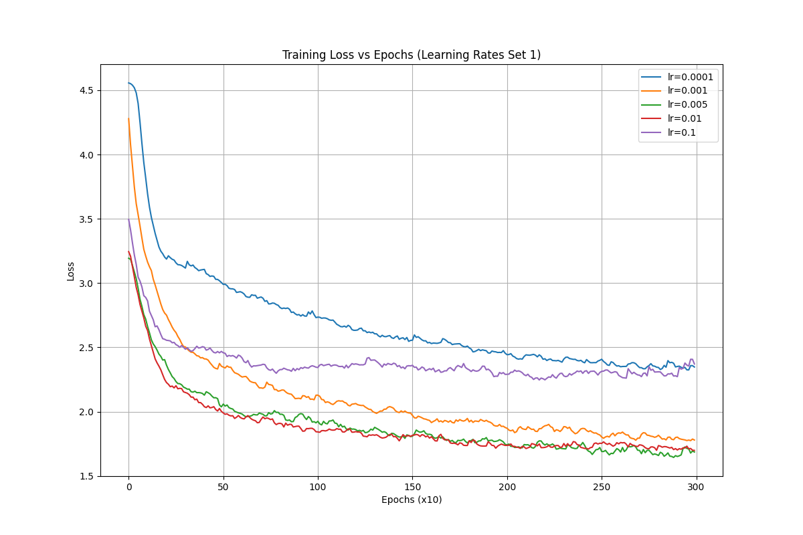

#  Assignment 3

## Character-level Language Modelling with LSTM

### 4.1

#### What does the code do when you use the flag––default_train. What do the defined parameters do?

When we use the --default_train flag, it initiates a training process for our character-level language model with predefined parameters. The code sets up the training to run for 3000 epochs, which means our model will see and learn from the training data 3000 times. 

During this process, the hidden_size of 128 determines how much information the model can remember about the text patterns it sees, while n_layers=2 means we're using two layers of LSTM to process this information, allowing the model to process the text twice, each time understanding it at a different level. 

The learning rate (lr) is set to 0.005, which controls how much the model adjusts its understanding with each training step. In our code, 0.005 means the model adjusts its understanding by 0.5% each time it sees a new piece of text, which helps it learn steadily without making too many mistakes.

We also have two monitoring parameters: print_every=100 tells the code to show us progress updates and a sample of generated text every 100 epochs, while plot_every=10 makes the code record the average loss every 10 epochs so we can track how well the model is learning over time.

Inside the training loop, we use random_training_set() to get chunks of text for training, and we keep track of the loss (how many mistakes the model makes) using loss_avg. Every 100 epochs, we see the time elapsed, current progress percentage, and current loss value, along with a sample of text generated using 'A' as the starting character. The loss values are stored in all_losses list every 10 epochs, which helps us to know how the model improves over time.

#### What is happening inside the training loop?

For each epoch out of the 3000, the loop gets a random chunk of text from Dickens and processes it character by character, updating the model's understanding. Inside the train function, it starts with fresh hidden states for each chunk and processes 200 characters sequentially. The loss is calculated using CrossEntropyLoss, and the model weights are updated using backpropagation.

The model starts with a random chunk of text (like "It was the best of times"). For each character, it tries to predict the next character. For example, given the input "I", it should predict "t"; given "t", it should predict " "; and given " ", it should predict "w". When the model makes a mistake, the loss increases. The optimizer then adjusts the model's weights to make better predictions next time. The loss value indicates how many mistakes the model is making - a lower value means fewer mistakes.

Every 100 epochs, we check the model's progress by showing the current loss, generating some sample text, and calculating the percentage complete.

### 4.2

#### Hyperparameter Tuning

For this experiment, several hyperparameters were varied to observe their effects on the model's performance. Specifically, different numbers of layers, learning rates, temperatures, and hidden sizes were experimented with. The detailed experiment logs can be found in the [experiment_logs.csv](experiment_logs.csv) file.

### 4.3

#### Plotting the Training Losses

**Discussion:**
The plot shows how the training loss changes over 3000 epochs for five different learning rates (from 0.0001 to 0.1). Here are some key points:

**Lowest learning rate 0.0001 (blue line):** It shows very stable but slow change. It decreases steadily but ends up with the highest loss around 2.4, meaning the model learns too slowly.

**Highest learning rate 0.1 (purple line):** It starts fast but plateaus quickly around a loss of 2.3. It shows some instability, suggesting the learning rate is too high.

**Learning rates 0.001, 0.005, and 0.01 (orange, green, red lines):** They demonstrate the most effective training behavior. These curves show both rapid initial convergence and continued improvement throughout training, eventually reaching the lowest loss values around 1.7-1.8. Particularly, learning rates 0.005 and 0.01 perform very similarly, suggesting that this range represents an optimal zone for this particular architecture and dataset.

In summary, too small a learning rate is slow but stable, while too large can be unstable. Learning rates between 0.005 and 0.01 work best for this model and data.

### 4.4 

#### Generated text with different temperatures:

**Prime string:** ith attent

**Temperature = 0.1:**
ith attent of the constion the come to have been the constion the more of the come to have been the constion t

**Temperature = 0.5:**
ith attent the portublishation the had before to hands's the same any come to his very consideming the bation,

**Temperature = 1.0:**
ith attentay:

  'In my look confurant, it on the
father pyetucted an whaty remwning finely-steaty, to be and

**Temperature = 2.0:**
ith attenty,
lome
sw? Bazlyondwanto
!Bleainsuppak hisponsl's-
-EpUyparled!s bjitrrys),S'w
up-b hom,ch?'

**Discussion:**
Temperature acts as a divisor for the output probabilities before we select the next character. When we use a very low temperature of 0.1, the model becomes extremely conservative, which is why we see it repeating "the constion" over and over. This happens because dividing by a small number makes the highest probabilities even more dominant, causing the model to always choose the most likely next character.

As we increase the temperature to 0.5, the division effect becomes more moderate. The model starts to consider other character choices beyond just the most probable one, leading to more varied text with words like "portublishation". It's still relatively structured but allows for some creativity.

At temperature 1.0, we're using the model's original probability distributions without much modification. This creates more natural-looking text with proper sentence structure and punctuation, as seen in the output with dialogue marks and natural-looking phrases.

When we push the temperature up to 2.0, we're dividing the probabilities by a larger number, which makes the differences between probable and improbable choices much smaller. This explains why we get such chaotic output with random-looking words like "Bazlyondwanto" and unusual punctuation patterns. The model is essentially treating all possible characters as nearly equally likely choices.

The temperature parameter fundamentally controls how spread out the probability distribution becomes when choosing the next character, determining whether the model plays it safe or takes creative risks in generating text.

#### Text Generation Risks and Responsibilities

When considering the risks of having a language model that generates text automatically, several important factors need to be addressed. One significant risk is that the model might produce inappropriate or harmful content, especially at higher temperatures where the output becomes more random and less controlled. As observed in the experiments, even with simple Dickens text, higher temperatures led to unpredictable outputs.

Responsibility for the output of such models is shared among various parties. The person who builds the model is responsible for ensuring that the model is trained on appropriate data and functions correctly. The person who writes the generating script must ensure that the script uses the model responsibly, including setting appropriate parameters like temperature. Finally, the person who uses the outputs must be cautious about how they use the generated text, ensuring it is suitable for the intended purpose and does not cause harm.

Several cautions should be taken when using language models for text generation. It is important to carefully select temperature settings, as very high temperatures can create random, potentially meaningless or inappropriate text, while very low temperatures might result in repetitive phrases. A moderate temperature around 0.8-1.0 is generally safer as it produces more predictable and controlled output. Additionally, it is crucial to review the generated text before using it, especially since the model may have been trained on data that contains outdated or biased views.

In conclusion, caution and responsibility are essential when using language models for text generation. Starting with conservative settings and gradually adjusting them while monitoring the outputs can help mitigate risks and ensure the generated text is appropriate and useful.

